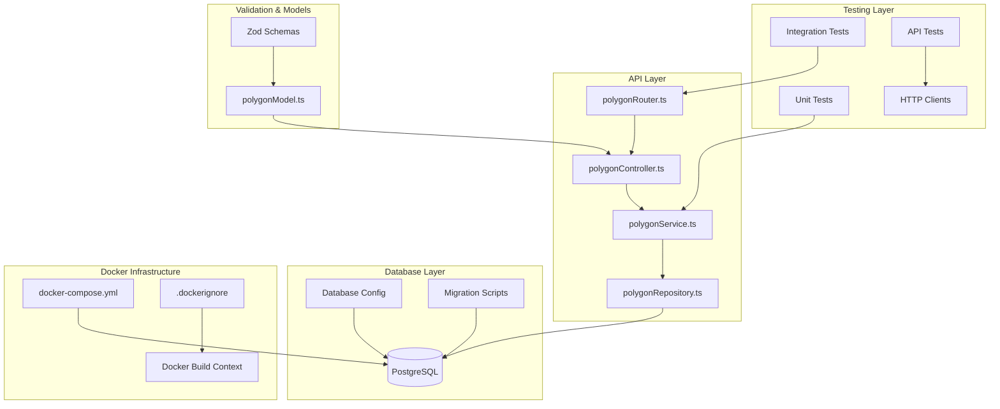

# Polygon API Backend Implementation Plan

## Overview

This plan outlines the implementation of a polygon management API following the existing project patterns, using PostgreSQL for persistence, Docker for database setup, and comprehensive testing coverage.

## Architecture Overview



## Implementation Plan

### Phase 1: Database Setup & Configuration

#### 1.1 PostgreSQL Docker Setup

- **File**: `docker-compose.yml`
  - PostgreSQL 15 container
  - Environment variables for database credentials
  - Volume mapping for data persistence
  - Health checks

#### 1.2 Database Configuration

- **Directory**: `app/backend/src/db/`
  - `config.ts` - Database connection configuration
  - `migrations/` - SQL migration files
  - `001_create_polygons_table.sql` - Initial table creation

#### 1.3 Docker Integration

- **File**: `app/backend/.dockerignore`
- **Package.json**: Add Docker Compose commands
- **Environment**: Database connection strings and credentials

### Phase 2: Core API Implementation

#### 2.1 Data Models & Validation

- **File**: `app/backend/src/api/polygon/polygonModel.ts`
  - Zod schemas for polygon validation
  - TypeScript interfaces
  - Point coordinate validation (array of [x, y] tuples)

#### 2.2 Repository Layer

- **File**: `app/backend/src/api/polygon/polygonRepository.ts`
  - PostgreSQL connection using `pg` client
  - Raw SQL queries for CRUD operations
  - JSONB handling for points data
  - Connection pooling

#### 2.3 Service Layer

- **File**: `app/backend/src/api/polygon/polygonService.ts`
  - Business logic implementation
  - 5-second delay for all operations
  - Error handling and logging
  - ServiceResponse pattern

#### 2.4 Controller Layer

- **File**: `app/backend/src/api/polygon/polygonController.ts`
  - Request/response handling
  - Input validation
  - HTTP status code management

#### 2.5 Router Configuration

- **File**: `app/backend/src/api/polygon/polygonRouter.ts`
  - Express router setup
  - OpenAPI documentation
  - Route definitions following REST conventions

### Phase 3: API Endpoints

#### 3.1 Create Polygon

- **Endpoint**: `POST /polygons`
- **Input**: `{ name: string, points: [[number, number]] }`
- **Output**: Created polygon with ID and timestamps
- **Validation**: Name required, points array validation

#### 3.2 Fetch All Polygons

- **Endpoint**: `GET /polygons`
- **Output**: Array of all polygons in specified format
- **Features**: Consistent response structure

#### 3.3 Delete Polygon

- **Endpoint**: `DELETE /polygons/:id`
- **Input**: Polygon ID in URL params
- **Output**: 204 No Content on success
- **Validation**: UUID format validation

### Phase 4: Testing Implementation

#### 4.1 Unit Tests

- **Directory**: `app/backend/src/api/polygon/__tests__/`
- **Files**:
  - `polygonService.test.ts`
  - `polygonRouter.test.ts`
- **Coverage**: All CRUD operations, error cases, validation

#### 4.2 API Integration Tests

- **Files**:
  - `app/backend/api-tests/vscode-rest-client/api.http` - Add polygon endpoints
  - `app/backend/api-tests/curl/curl_tests.sh` - Add polygon curl commands
  - `app/backend/api-tests/httpie/httpie_tests.sh` - Add polygon httpie commands

### Phase 5: Integration & Documentation

#### 5.1 Server Integration

- **File**: `app/backend/src/server.ts`
  - Add polygon router to Express app
  - Database connection initialization

#### 5.2 Package Dependencies

- **File**: `app/backend/package.json`
  - Add `pg` and `@types/pg` dependencies
  - Add Docker Compose scripts

## Database Schema

```sql
CREATE TABLE polygons (
    id SERIAL PRIMARY KEY,
    name VARCHAR(255) NOT NULL,
    points JSONB NOT NULL,
    created_at TIMESTAMP DEFAULT CURRENT_TIMESTAMP
);

-- Index for better JSONB query performance
CREATE INDEX idx_polygons_points ON polygons USING GIN (points);
```

## API Response Format

Following the existing ServiceResponse pattern:

```typescript
// Success Response
{
  "success": true,
  "message": "Polygon created successfully",
  "responseObject": {
    "id": 1,
    "name": "P1",
    "points": [[12.3, 12.0], [16.3, 12.0], [16.3, 8.0], [12.3, 8.0]],
    "created_at": "2025-06-28T09:00:00.000Z"
  },
  "statusCode": 201
}

// Error Response
{
  "success": false,
  "message": "Polygon not found",
  "responseObject": null,
  "statusCode": 404
}
```

## File Structure

```
app/backend/
├── docker-compose.yml
├── .dockerignore
├── package.json (updated)
├── src/
│   ├── db/
│   │   ├── config.ts
│   │   └── migrations/
│   │       └── 001_create_polygons_table.sql
│   ├── api/
│   │   └── polygon/
│   │       ├── polygonModel.ts
│   │       ├── polygonRepository.ts
│   │       ├── polygonService.ts
│   │       ├── polygonController.ts
│   │       ├── polygonRouter.ts
│   │       └── __tests__/
│   │           ├── polygonService.test.ts
│   │           └── polygonRouter.test.ts
│   └── server.ts (updated)
└── api-tests/
    ├── vscode-rest-client/api.http (updated)
    ├── curl/curl_tests.sh (updated)
    └── httpie/httpie_tests.sh (updated)
```

## Key Features

1. **PostgreSQL Integration**: Raw SQL with `pg` client for direct control
2. **Docker Setup**: Complete containerization with docker-compose
3. **5-Second Delays**: Applied to all polygon operations as specified
4. **Comprehensive Testing**: Unit tests and API integration tests
5. **Type Safety**: Full TypeScript implementation with Zod validation
6. **OpenAPI Documentation**: Automatic API documentation generation
7. **Error Handling**: Consistent error responses and logging
8. **Data Persistence**: PostgreSQL ensures data survives server restarts

## Dependencies to Add

```json
{
  "dependencies": {
    "pg": "^8.11.3"
  },
  "devDependencies": {
    "@types/pg": "^8.10.9"
  }
}
```

## Docker Commands

```json
{
  "scripts": {
    "docker:up": "docker-compose up -d",
    "docker:down": "docker-compose down",
    "docker:logs": "docker-compose logs -f postgres"
  }
}
```

## Assignment Requirements Compliance

### Core Requirements

- ✅ **Create polygon API**: POST endpoint with name and points input
- ✅ **Delete polygon API**: DELETE endpoint with polygon ID
- ✅ **Fetch polygons API**: GET endpoint returning all polygons in specified format
- ✅ **5-second delay**: Applied to all polygon operations
- ✅ **Data persistence**: PostgreSQL database survives backend restarts
- ✅ **External libraries**: Using pg, zod, express, etc.

### Optional Requirements

- ✅ **API tests**: Comprehensive unit and integration tests
- ✅ **Dockerization**: Complete Docker setup with docker-compose

### Technical Implementation

- ✅ **Backend language**: Node.js/TypeScript
- ✅ **Database**: PostgreSQL with JSONB for points storage
- ✅ **API format**: RESTful endpoints with consistent response structure
- ✅ **Error handling**: Proper HTTP status codes and error messages
- ✅ **Validation**: Input validation using Zod schemas

This plan ensures a robust, well-tested polygon API that follows the existing project patterns while meeting all the assignment requirements. The implementation will be scalable, maintainable, and fully integrated with the current backend architecture.
