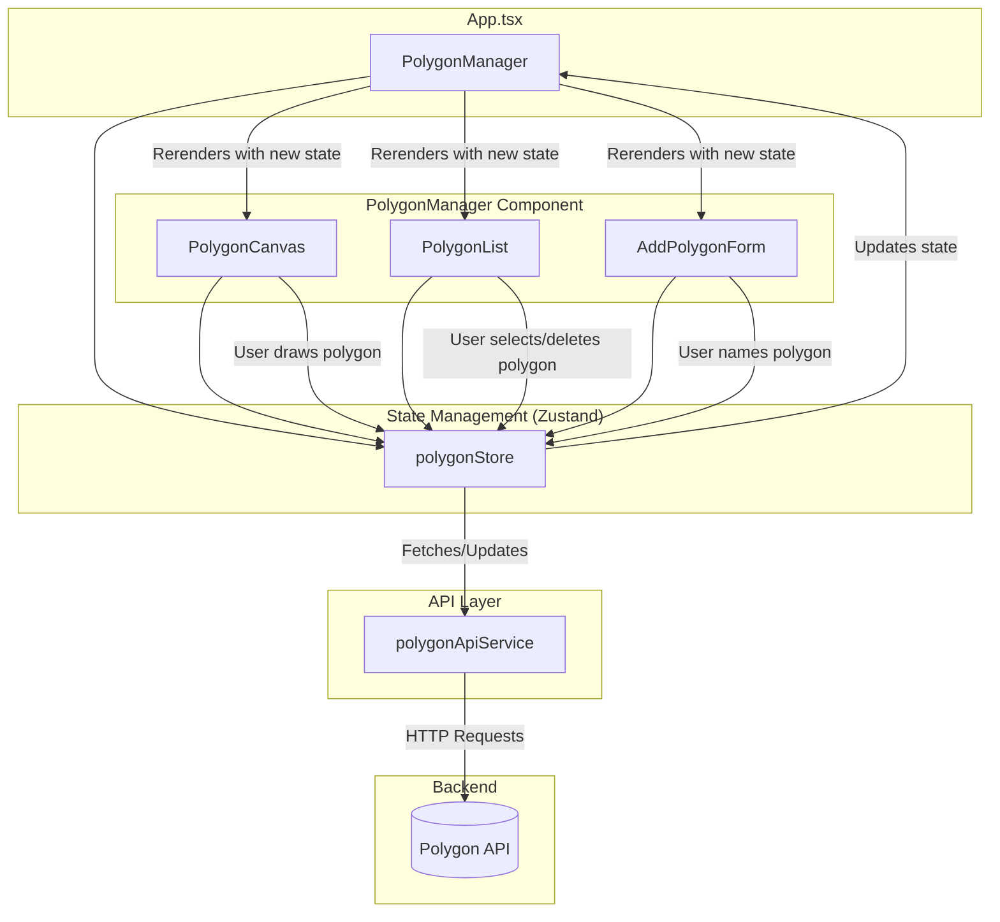

# Frontend Polygon Feature Implementation Plan

This document outlines the plan for implementing the new polygon drawing and management feature in the frontend application. The design is based on the requirements from `app/assignment.md` and follows the existing architecture of the `todo` feature.

## 1. User Interaction and Experience (UX)

The user experience is designed to be intuitive and provide clear feedback during the interaction.

### 1.1. Main View

The main view will be divided into two primary sections:

- **Canvas Area**: A large canvas on one side, displaying a random background image fetched from `https://picsum.photos/1920/1080`.
- **Sidebar**: A sidebar on the other side, which will contain:
  - A list of all saved polygons.
  - A "Create New Polygon" button.

### 1.2. Creating a New Polygon

1.  **Initiate Drawing**: The user clicks the "Create New Polygon" button, which activates a "drawing mode". The UI will display a prompt, such as "Click on the canvas to start drawing."
2.  **Drawing Points**: The user clicks on the canvas to place points. Each click adds a vertex, and lines are drawn connecting the points to visualize the polygon's shape in real-time.
3.  **Completing the Polygon**: To complete the drawing, the user can either:
    - Press the `Enter` key.
    - Click a "Finish Drawing" button.
4.  **Naming and Saving**: Once the drawing is complete, a modal or an inline form prompts the user to enter a name for the polygon. After providing a name and clicking "Save," the new polygon is sent to the backend. It then appears in the sidebar list, and the canvas is updated to show the final saved polygon.

### 1.3. Viewing and Managing Polygons

- The sidebar lists all saved polygons by name.
- Hovering over a polygon's name in the list will highlight the corresponding polygon on the canvas (e.g., by changing its border color).
- Each polygon in the list will have a "Delete" button. Clicking this button will prompt the user for confirmation before sending a delete request to the backend.

---

## 2. Frontend Architecture

The feature will be built by following the established patterns in the existing codebase, specifically the `todo` feature.

### 2.1. File Structure

New files will be created in the following locations within `app/frontend/src/`:

- **Types**: `types/polygon.types.ts`
- **API Service**: `services/polygonApiService.ts`
- **State Management**: `features/polygon/polygonStore.ts`
- **Components**: `features/polygon/`

### 2.2. Component Breakdown

- **`features/polygon/PolygonManager.tsx`**: The main container component, analogous to `Todos.tsx`. It will manage the overall layout and integrate the other polygon components.
- **`features/polygon/PolygonCanvas.tsx`**: A dedicated component to render the HTML `<canvas>`. It will be responsible for:
  - Drawing the random background image.
  - Rendering saved polygons.
  - Handling mouse-click events for drawing new polygons.
  - Displaying the in-progress polygon as it's being drawn.
- **`features/polygon/PolygonList.tsx`**: A component to display the list of saved polygons, including interaction elements for selection and deletion.
- **`features/polygon/AddPolygonForm.tsx`**: A form component for naming a new polygon after its points have been defined on the canvas.
- **`components/`**: Generic, reusable components (like `Button`, `Input`, `Modal`) will be placed in the global `src/components/` directory to be shared across features.

### 2.3. State Management (`polygonStore.ts`)

The Zustand store will manage the feature's state:

- **State**: `polygons: Polygon[]`, `isLoading: boolean`, `error: string | null`, `isDrawing: boolean`, `currentPoints: Point[]`, `selectedPolygonId: number | null`.
- **Actions**: `fetchPolygons`, `addPolygon`, `removePolygon`, `startDrawing`, `addPoint`, `finishDrawing`.

### 2.4. API Service (`polygonApiService.ts`)

This service will encapsulate all communication with the backend polygon API.

- **`fetchPolygons(): Promise<Polygon[]>`**
- **`createPolygon(name: string, points: Point[]): Promise<Polygon>`**
- **`deletePolygon(id: number): Promise<void>`**

---

## 3. Data Flow Diagram

The following Mermaid diagram illustrates the proposed component structure and data flow:

